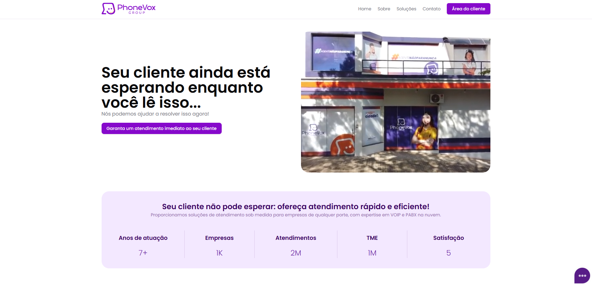

# Phonevox Landing Page
A Phonevox Landing Page é uma página web desenvolvida para promover os serviços e soluções da Phonevox. Ela contém informações sobre a empresa, suas soluções, formas de contato e uma área exclusiva para clientes.

#### Tecnologias Utilizadas
- Next.js 
- Shadcn UI 
- Tailwind CSS 
- Docker

#### Estrutura da Página
A landing page é dividida em várias seções:

- Home: Apresentação inicial da empresa e sua proposta de valor.

- Sobre: Informações detalhadas sobre a Phonevox, missão, visão e valores.

- Soluções: Descrição dos serviços e soluções oferecidas pela empresa.

- Contato: Formulário de contato e detalhes para o envio de mensagens.

- Callcenter: Link para acessar a plataforma exclusiva para clientes.

- Área do Cliente: Link para acessar a plataforma exclusiva para clientes.

#### Instruções de Execução
Requisitos

- Node.js v22 ou superior
- Nginx
- npm v7 ou superior
- Docker

#### Rodando com Docker
Para rodar a aplicação em um container Docker, siga as etapas abaixo:

Construir a imagem Docker: `docker build -t phonevox-site .`

Rodar o container: `docker run -d --restart always -p porta_publica:porta_interna --name phonevox-app phonevox-site`

Acesse a página no navegador: `http://localhost:PORT`

#### Recompilando imagem
Caso você altere algo e precise dar um git pull do repositório, pode fazer os seguinte.

Terá um arquivo com o nome de rebuild-docker.sh que você pode rodar ou depois tentar integrar com github actions.

